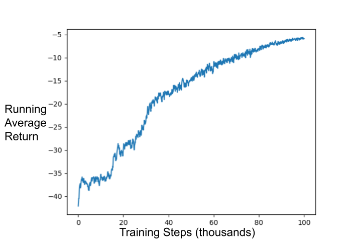

# Basic Learning Demo with MCTX
A very basic implementation of AlphaZero style learning with the MCTX framework for Monte Carlo Tree Search in JAX. The included naive_tree_search.py script assumes the agent have access to the exact environment dynamics and does not include any model learning, but rather learns a policy and value function from tree search results as in AlphaZero.

## Usage
Using this repo requires JAX, Haiku, NumPy and wandb. You can start an experiment with 
```bash
python3 basic_tree_search.py.py -c config.json -o naive_tree_search -s 0
```
The flags have the following meaning:

-c specifies the configuration file, an example of which is provided in config.json.<br>
-o prefix for file names containing output data.<br> 
-s specifies the random seed.<br>

## Preliminary Results
The following plots display running average return as a function of training steps on a simple Asterix like game which is implemented in jax in the file jax_environments.py. It should be straightforward to apply to other environments written in jax with a similar interface.
